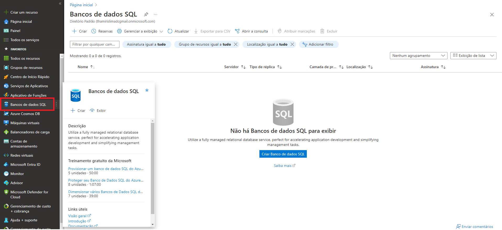
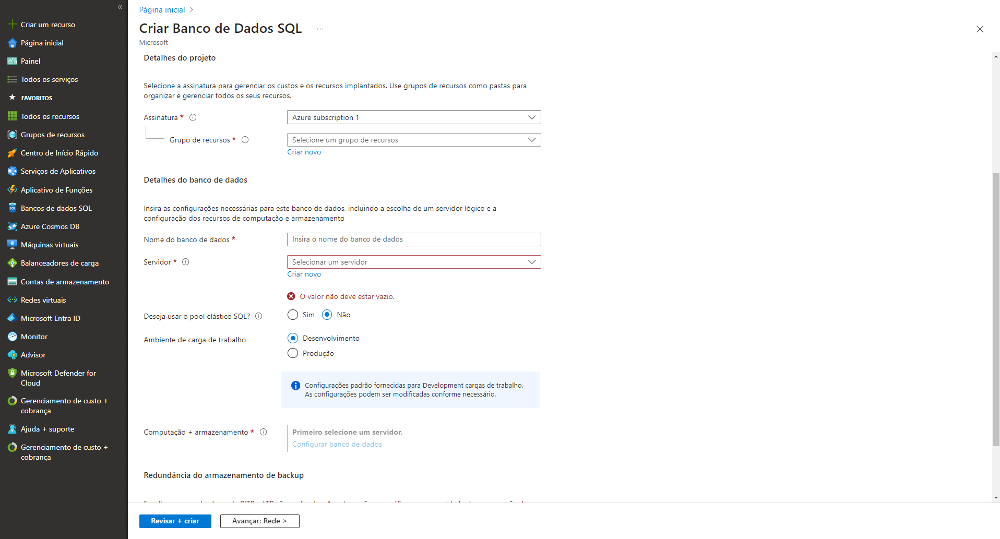
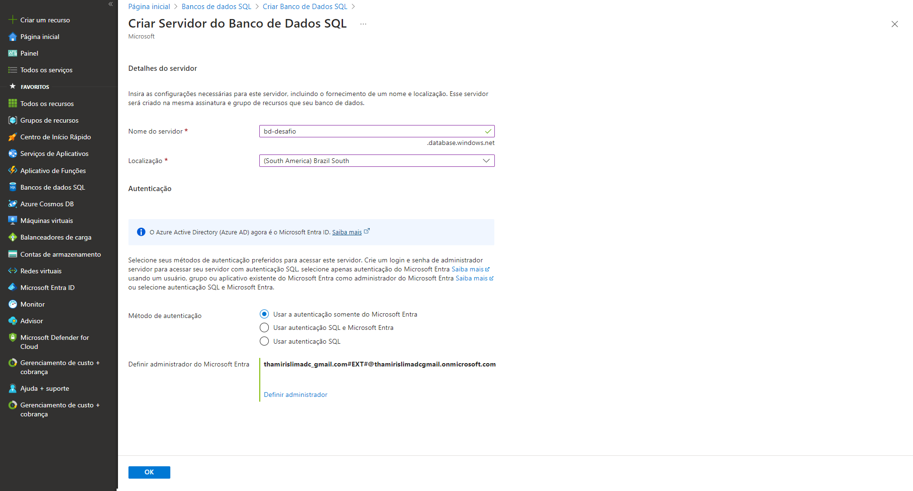
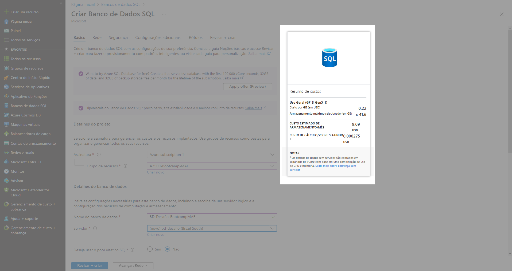
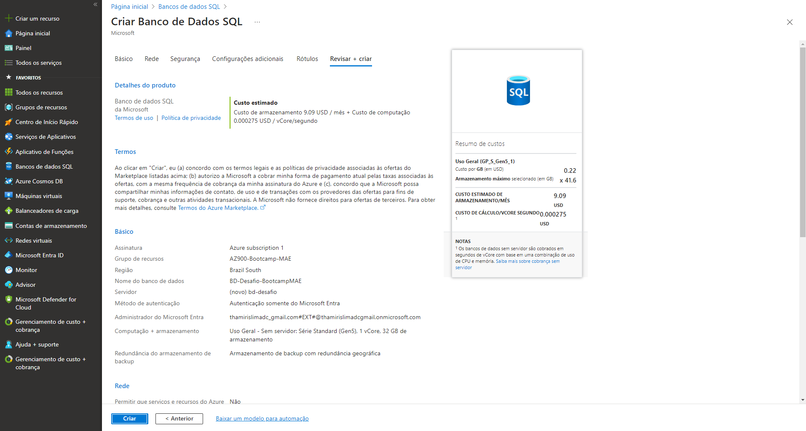
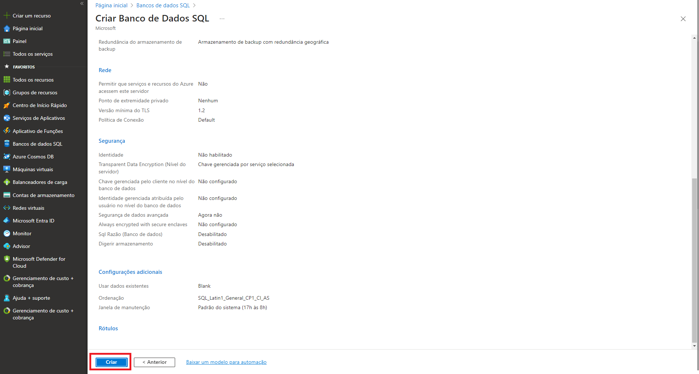

# Desafio - Configurando uma instância de Banco de Dados na Azure

## 1º passo
Na página principal do portal Azure, vá no meu lateral esquerdo, procure por 'Banco de Dados SQL', clique na opção e depois em 'criar'.

## 2º passo 
Preencha os dados de configuração da sua instância. 

## 3º passo 
Crie um novo servidor de Banco de Dados SQL. Lembre-se de preencher todos os campos obrigatórios e selecionar um usuário ou grupo como administrador do Microsoft Entra.

## 4º passo
Após criar o servidor, aparecerá a calculadora de custos na página de criação.

## 5º passo 
Clique em 'revisar + criar' para receber um resumo de todas configurações realizadas e o custo estimado por mês.

## 6º passo
Por fim, clique em 'criar'.

