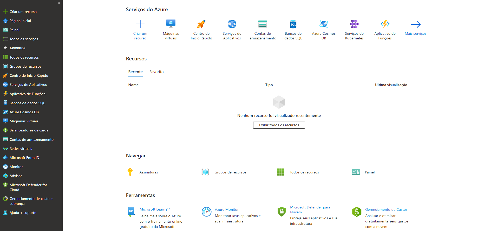
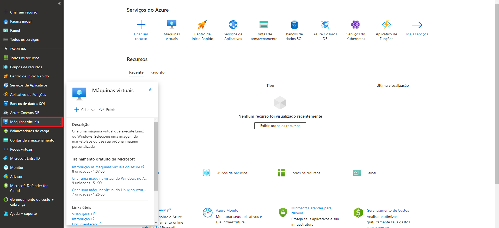
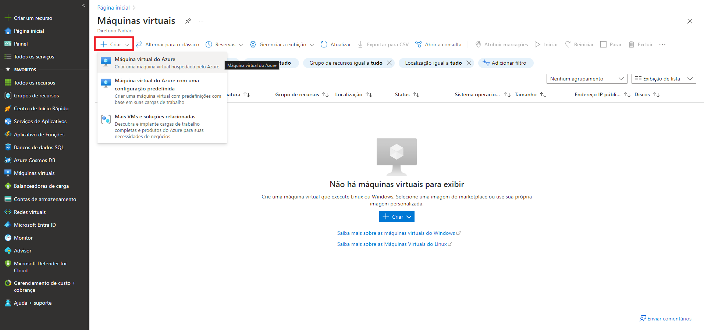

# Desafio - Criando Máquinas Virtuais na Azure

- 1º passo: entrar no Portal Azure

- 2º passo: clicar em 'Máquinas Virtuais' no menu lateral esquerdo

- 3º passo: clicar em '+ Criar' e escolher umas das três opções do menu drop down
