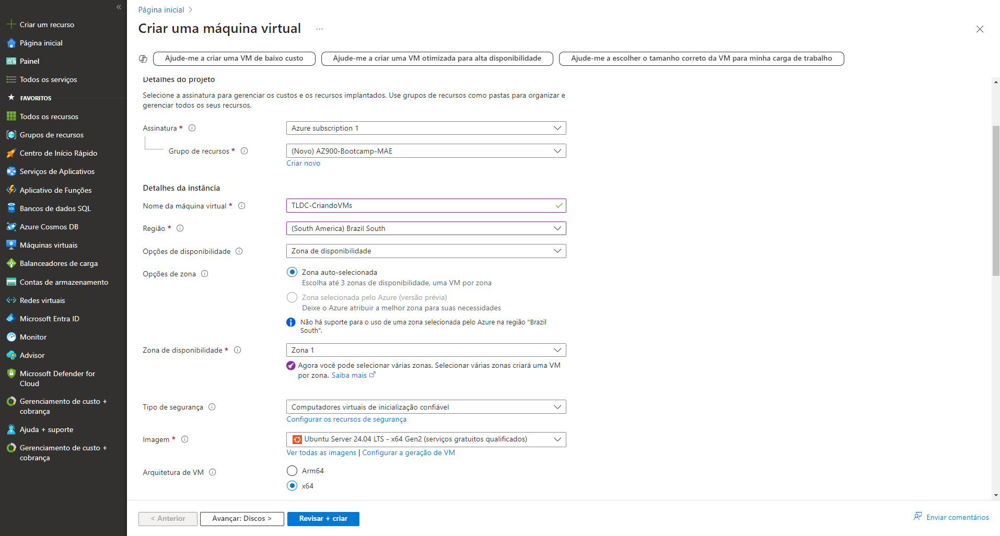
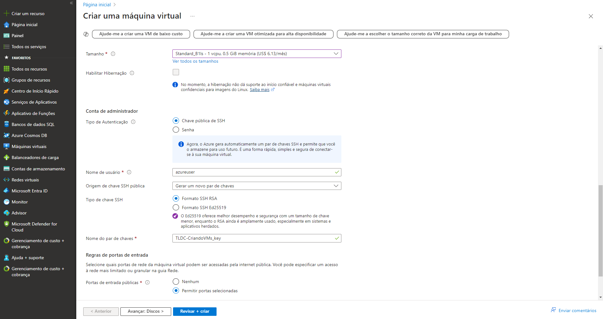
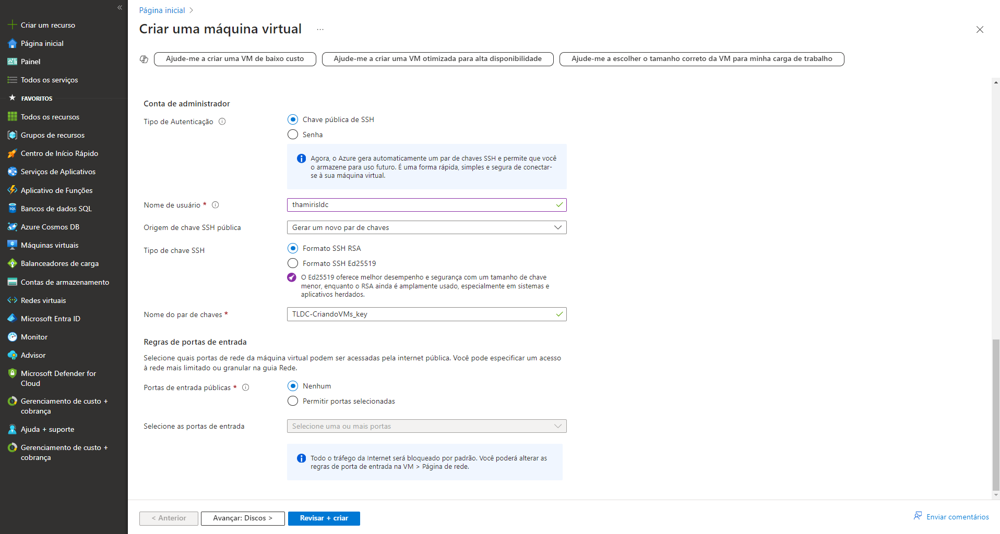
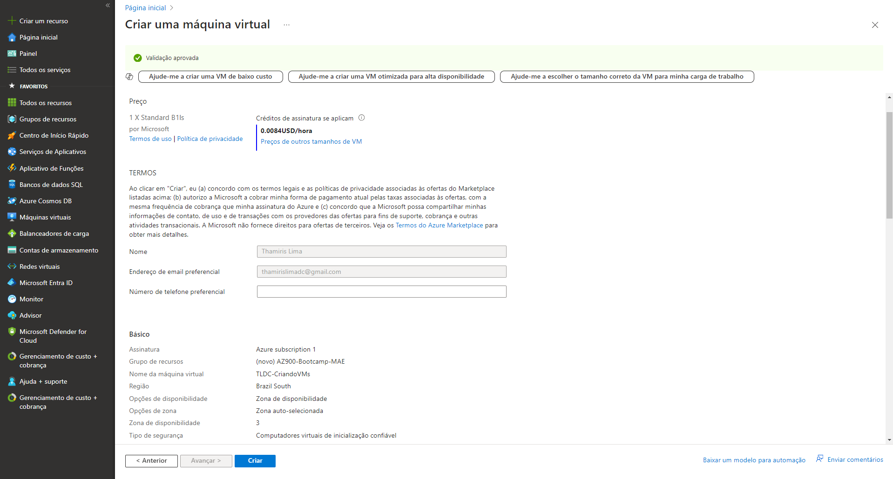
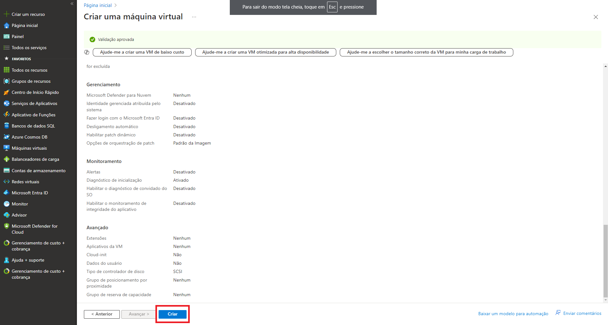

# Desafio - Criando Máquinas Virtuais na Azure

- 1º passo: entrar no Portal Azure

- 2º passo: clicar em 'Máquinas Virtuais' no menu lateral esquerdo

- 3º passo: clicar em '+ Criar' e escolher umas das três opções do menu drop down

- 4º passo: preencher todos os campos obrigatório. O que não tiver com o asterisco (*) pode ser mantido como default.

- 5º passo: clicar em 'revisar + criar' para conferir todas as informações configuradas para a VM, incluindo a projeção do valor que será cobrado.

- 6º passo: por fim, clique em 'criar'.
